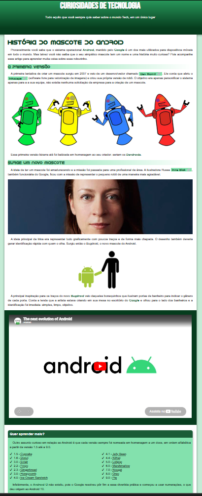

# 📱 Curiosidades de Tecnologia

Uma página web estática sobre a história do mascote do Android, desenvolvida com HTML e CSS.

---

## 📷 Preview

---

## 🧠 O que foi aplicado

* HTML semântico (`header`, `main`, `article`, `aside`, `footer`)
* CSS com variáveis (`:root`)
* Layout responsivo básico
* Imagens adaptáveis (`picture`)
* Vídeo do YouTube responsivo
* Indicador de links externos

---

## ⚠️ Decisão técnica

Projeto desenvolvido propositalmente **sem uso de classes e IDs (com exceções)** para reforçar domínio de seletores CSS e estrutura semântica.

---

## 👨‍💻 Autor

Leonardo Fabrício
